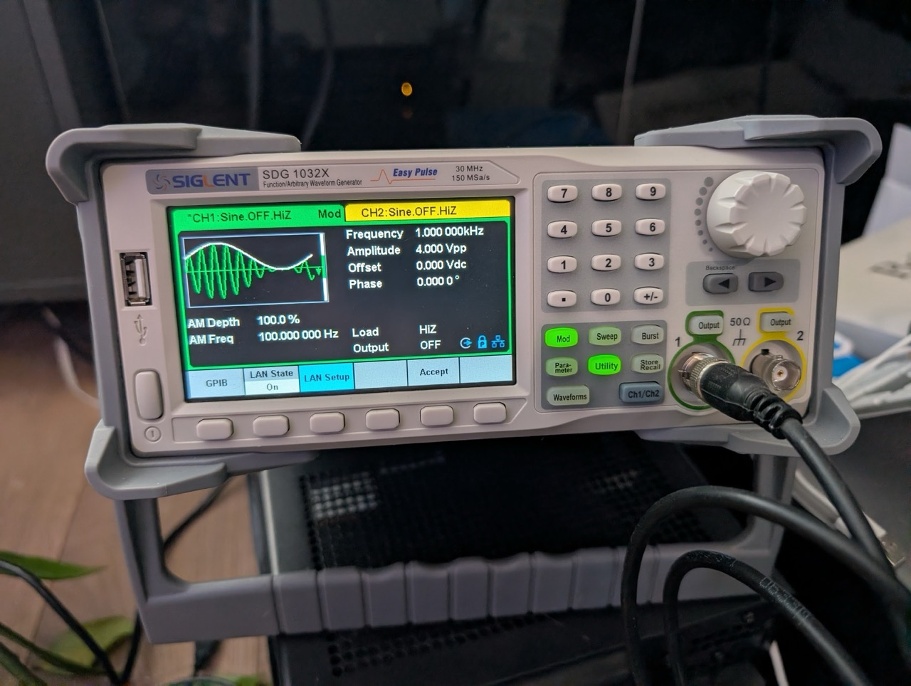

# siglent-sdg-mcp

A [Model Context Protocol](https://modelcontextprotocol.io/) (MCP) server that lets AI assistants control Siglent SDG waveform generators over your local network. Connect Claude to your bench and generate, modulate, and configure signals through natural language.

## Overview

This MCP server communicates with Siglent SDG waveform generators via SCPI commands over TCP sockets (port 5025). No VISA drivers or NI-MAX installation required — just a network connection to your generator.



**Key features:**

- 21 tools covering output control, waveform generation, modulation, sweep, burst, arbitrary waveforms, and more
- Dual-channel support (C1 and C2)
- 8 waveform types: sine, square, ramp, pulse, noise, arbitrary, DC, PRBS
- 8 modulation types: AM, DSB-AM, FM, PM, PWM, ASK, FSK, PSK
- Auto-connect on startup via environment variable
- Query queue serializes commands automatically — tools can safely run in parallel
- Raw SCPI escape hatch for any command not covered by the built-in tools

## Compatibility

| Status | Model |
|--------|-------|
| Tested | SDG1032X |
| Expected to work | SDG1000X series (SDG1062X, etc.) |
| May work | Other Siglent SDG models with SCPI over TCP support |

The server uses standard SCPI commands from the SDG series programming guide. Other Siglent models that support the same command set over port 5025 should work with little or no modification.

## Quick Start

You need a Siglent waveform generator accessible on your network (TCP port 5025). Pick one of the three options below and add the config to your `.mcp.json` (in your project directory, or `~/.claude/.mcp.json` for global access).

Replace `192.168.1.126` with your generator's IP address.

### Option A: Docker (recommended)

No Node.js installation required. Works on Linux, macOS, and Windows (via WSL2 or Docker Desktop).

```json
{
  "mcpServers": {
    "siglent-sdg": {
      "type": "stdio",
      "command": "docker",
      "args": [
        "run", "--rm", "-i",
        "-e", "SIGLENT_SDG_IP=192.168.1.126",
        "ghcr.io/magnusjohansson/siglent-sdg-mcp:latest"
      ]
    }
  }
}
```

### Option B: npx

Requires Node.js 20+. Downloads and runs the package automatically.

```json
{
  "mcpServers": {
    "siglent-sdg": {
      "type": "stdio",
      "command": "npx",
      "args": ["-y", "siglent-sdg-mcp"],
      "env": {
        "SIGLENT_SDG_IP": "192.168.1.126"
      }
    }
  }
}
```

### Option C: Clone and build

```bash
git clone https://github.com/magnusjohansson/siglent-sdg-mcp.git
cd siglent-sdg-mcp
npm install
npm run build
```

```json
{
  "mcpServers": {
    "siglent-sdg": {
      "type": "stdio",
      "command": "node",
      "args": ["/path/to/siglent-sdg-mcp/build/index.js"],
      "env": {
        "SIGLENT_SDG_IP": "192.168.1.126"
      }
    }
  }
}
```

Replace `/path/to/siglent-sdg-mcp` with the actual path to your clone.

### Environment Variables

| Variable | Required | Default | Description |
|----------|----------|---------|-------------|
| `SIGLENT_SDG_IP` | No | — | Generator IP address for auto-connect on startup |
| `SIGLENT_IP` | No | — | Fallback if `SIGLENT_SDG_IP` is not set |
| `SIGLENT_SDG_PORT` | No | `5025` | TCP port (only change if your setup differs) |
| `SIGLENT_PORT` | No | `5025` | Fallback if `SIGLENT_SDG_PORT` is not set |

### Auto-Connect Behavior

If `SIGLENT_SDG_IP` (or `SIGLENT_IP`) is set, the server attempts to connect to the generator immediately after starting. This runs in the background and does **not** block the MCP server — Claude can start using other tools right away. If the generator is offline or unreachable, the server logs a warning and you can connect manually later using the `connect` tool.

If neither variable is set, the server starts without a connection. Use the `connect` tool to connect when ready.

## Using with Other AI Clients

The Quick Start examples above use Claude Code's `.mcp.json` format, which includes a `"type": "stdio"` field. Other AI clients use the same JSON structure but **without** the `"type"` field and with different config file locations.

### Claude Desktop

Edit `claude_desktop_config.json`:

- **Windows:** `%APPDATA%\Claude\claude_desktop_config.json`
- **macOS:** `~/Library/Application Support/Claude/claude_desktop_config.json`

#### Docker

```json
{
  "mcpServers": {
    "siglent-sdg": {
      "command": "docker",
      "args": [
        "run", "--rm", "-i",
        "-e", "SIGLENT_SDG_IP=192.168.1.126",
        "ghcr.io/magnusjohansson/siglent-sdg-mcp:latest"
      ]
    }
  }
}
```

#### npx

```json
{
  "mcpServers": {
    "siglent-sdg": {
      "command": "npx",
      "args": ["-y", "siglent-sdg-mcp"],
      "env": {
        "SIGLENT_SDG_IP": "192.168.1.126"
      }
    }
  }
}
```

> **Note:** You must fully restart Claude Desktop after changing the config file.

### Cursor

Edit one of:

- **User-level:** `~/.cursor/mcp.json` (available across all projects)
- **Project-level:** `.cursor/mcp.json` (shared with your team via version control)

You can also add servers through the UI: **Settings > Cursor Settings > MCP > Add new global MCP server**.

#### Docker

```json
{
  "mcpServers": {
    "siglent-sdg": {
      "command": "docker",
      "args": [
        "run", "--rm", "-i",
        "-e", "SIGLENT_SDG_IP=192.168.1.126",
        "ghcr.io/magnusjohansson/siglent-sdg-mcp:latest"
      ]
    }
  }
}
```

#### npx

```json
{
  "mcpServers": {
    "siglent-sdg": {
      "command": "npx",
      "args": ["-y", "siglent-sdg-mcp"],
      "env": {
        "SIGLENT_SDG_IP": "192.168.1.126"
      }
    }
  }
}
```

### Windsurf

Edit `mcp_config.json`:

- **Windows:** `%USERPROFILE%\.codeium\windsurf\mcp_config.json`
- **macOS/Linux:** `~/.codeium/windsurf/mcp_config.json`

You can also configure servers through the UI: **Cascade panel > MCP icon > Manage MCP Servers > View raw config**.

#### Docker

```json
{
  "mcpServers": {
    "siglent-sdg": {
      "command": "docker",
      "args": [
        "run", "--rm", "-i",
        "-e", "SIGLENT_SDG_IP=192.168.1.126",
        "ghcr.io/magnusjohansson/siglent-sdg-mcp:latest"
      ]
    }
  }
}
```

#### npx

```json
{
  "mcpServers": {
    "siglent-sdg": {
      "command": "npx",
      "args": ["-y", "siglent-sdg-mcp"],
      "env": {
        "SIGLENT_SDG_IP": "192.168.1.126"
      }
    }
  }
}
```

### Google Antigravity

Configuration is managed through the IDE's UI:

1. Open the **Agent pane** on the right side of the workspace
2. Click the **`...`** button at the top
3. Select **MCP Servers**
4. Click **Manage MCP Servers**
5. Click **View raw config**
6. Add the configuration below and save

#### Docker

```json
{
  "mcpServers": {
    "siglent-sdg": {
      "command": "docker",
      "args": [
        "run", "--rm", "-i",
        "-e", "SIGLENT_SDG_IP=192.168.1.126",
        "ghcr.io/magnusjohansson/siglent-sdg-mcp:latest"
      ]
    }
  }
}
```

#### npx

```json
{
  "mcpServers": {
    "siglent-sdg": {
      "command": "npx",
      "args": ["-y", "siglent-sdg-mcp"],
      "env": {
        "SIGLENT_SDG_IP": "192.168.1.126"
      }
    }
  }
}
```

Replace `192.168.1.126` with your generator's IP address in all examples above.

### ChatGPT Desktop

ChatGPT Desktop only supports remote HTTPS MCP servers (called "connectors"), not local stdio servers. Since this MCP server uses stdio transport, it is not directly compatible with ChatGPT Desktop.

## Tools

21 tools across 9 categories.

| Category | Tool | Description |
|----------|------|-------------|
| Connection | `connect` | Connect to waveform generator over TCP |
| | `disconnect` | Close the connection |
| | `identify` | Query device ID (manufacturer, model, serial, firmware) |
| Output | `get_output` | Read output state, load impedance, and polarity |
| | `configure_output` | Turn output on/off, set load impedance and polarity |
| Basic Waveform | `get_basic_wave` | Read waveform parameters (type, frequency, amplitude, etc.) |
| | `configure_basic_wave` | Set waveform type, frequency, amplitude, offset, phase, duty cycle, and more |
| Modulation | `get_modulation` | Read modulation settings (type, source, depth/deviation) |
| | `configure_modulation` | Set modulation type, source, frequency, depth, deviation, and carrier parameters |
| Sweep | `get_sweep` | Read sweep parameters (time, frequency range, mode, direction) |
| | `configure_sweep` | Set sweep time, start/stop frequencies, mode, direction, trigger, and marker |
| Burst | `get_burst` | Read burst parameters (mode, period, trigger, cycle count) |
| | `configure_burst` | Set burst mode, period, trigger source, cycle count, delay, and gate polarity |
| Arbitrary Waveform | `get_arbitrary_wave` | Read the current arbitrary waveform selection |
| | `set_arbitrary_wave` | Set arbitrary waveform by index (built-in) or name (user-defined) |
| Utility | `reset` | Reset generator to factory defaults (*RST) |
| | `copy_channel` | Copy all parameters from one channel to another |
| | `configure_sync` | Configure sync output signal |
| | `equal_phase` | Synchronize phase of both channels |
| SCPI | `scpi_query` | Send arbitrary SCPI query and return the response |
| | `scpi_command` | Send arbitrary SCPI command (no response expected) |

## Example Conversations

### Generate a basic waveform

> **You:** Output a 1 kHz sine wave at 2 Vpp on channel 1.
>
> Claude calls `configure_basic_wave` with `channel: "C1"`, `waveform_type: "SINE"`, `frequency: 1000`, `amplitude: 2`, then `configure_output` with `channel: "C1"`, `state: "ON"`.

### Set up modulation

> **You:** Add AM modulation to channel 1 with 80% depth at 100 Hz.
>
> Claude calls `configure_modulation` with `channel: "C1"`, `state: "ON"`, `type: "AM"`, `depth: 80`, `frequency: 100`.

### Configure a frequency sweep

> **You:** Sweep channel 2 from 100 Hz to 10 kHz over 5 seconds.
>
> Claude calls `configure_sweep` with `channel: "C2"`, `state: "ON"`, `start: 100`, `stop: 10000`, `time: 5`, then `configure_output` with `channel: "C2"`, `state: "ON"`.

### Check current settings

> **You:** What's the current waveform setup on both channels?
>
> Claude calls `get_basic_wave` on both C1 and C2 in parallel and reports the waveform type, frequency, amplitude, and other settings for each channel.

### Copy channel configuration

> **You:** Make channel 2 match channel 1's settings.
>
> Claude calls `copy_channel` with `source: "C1"`, `destination: "C2"`.

### Set up burst mode

> **You:** Configure channel 1 for 5-cycle bursts triggered externally.
>
> Claude calls `configure_burst` with `channel: "C1"`, `state: "ON"`, `burst_mode: "NCYC"`, `cycles: "5"`, `trigger_source: "EXT"`.

## Architecture

```
Claude Code <-- stdio/JSON-RPC --> siglent-sdg-mcp <-- TCP/SCPI --> Generator:5025
```

- **Transport:** MCP over stdio (JSON-RPC 2.0)
- **Protocol:** SCPI commands over raw TCP sockets, newline-terminated
- **Query Queue:** All SCPI queries are serialized through an internal queue. The generator processes one command at a time, so even when tools issue parallel requests, the queue ensures they're sent sequentially.
- **Auto-Connect:** If `SIGLENT_SDG_IP` is set, connects in the background on startup without blocking the MCP server.

## Development

```bash
npm run build       # Compile TypeScript
npm run watch       # Watch mode — recompile on changes
npm run dev         # Build and run
npm run inspector   # Launch with MCP Inspector for debugging
```

### Docker (local build)

Build the image locally:

```bash
docker build -t siglent-sdg-mcp .
```

Then use the local image in your `.mcp.json`:

```json
{
  "mcpServers": {
    "siglent-sdg": {
      "type": "stdio",
      "command": "docker",
      "args": [
        "run", "--rm", "-i",
        "-e", "SIGLENT_SDG_IP=192.168.1.126",
        "siglent-sdg-mcp"
      ]
    }
  }
}
```

### Project Structure

```
src/
  index.ts              # Entry point, MCP server setup
  connection.ts         # TCP socket manager with query queue
  tools/
    connection.ts       # connect, disconnect, identify
    output.ts           # get_output, configure_output
    basic-wave.ts       # get_basic_wave, configure_basic_wave
    modulation.ts       # get_modulation, configure_modulation
    sweep.ts            # get_sweep, configure_sweep
    burst.ts            # get_burst, configure_burst
    arbitrary.ts        # get_arbitrary_wave, set_arbitrary_wave
    utility.ts          # reset, copy_channel, configure_sync, equal_phase
    scpi.ts             # scpi_query, scpi_command
```

## Troubleshooting

### "Not connected to waveform generator"

The generator isn't connected yet. Either set `SIGLENT_SDG_IP` in your `.mcp.json` env for auto-connect, or use the `connect` tool manually.

### Connection timeout

- Verify the generator's IP address (check the generator's Utility > Interface menu)
- Ensure port 5025 is accessible (try `telnet <generator-ip> 5025` from your machine)
- Check that no firewall is blocking the connection
- The generator only accepts one TCP connection at a time — close any other SCPI clients

### Query timeout

Some SCPI queries can take a few seconds. The default timeout is 5 seconds. For `scpi_query`, you can increase the timeout with the `timeout_ms` parameter.

### Docker: can't reach the waveform generator

By default, Docker containers can reach LAN devices via the bridge network (NAT). If the container can't connect to your generator:

- Verify the generator is reachable from your host: `telnet 192.168.1.126 5025`
- On Linux, try adding `--network host` to the Docker args:
  ```json
  "args": ["run", "--rm", "-i", "--network", "host", "-e", "SIGLENT_SDG_IP=192.168.1.126", "ghcr.io/magnusjohansson/siglent-sdg-mcp:latest"]
  ```
  Note: `--network host` does not work on macOS or Windows Docker Desktop.

### Docker: wrong architecture / exec format error

The published image supports `linux/amd64` and `linux/arm64`. Docker should pull the correct one automatically. If you see an exec format error, pull explicitly:

```bash
docker pull --platform linux/amd64 ghcr.io/magnusjohansson/siglent-sdg-mcp:latest
```

### "CHDR" appears in responses

This shouldn't happen — the server sets `CHDR OFF` on connect. If you see command headers in responses, try disconnecting and reconnecting.

## License

MIT — see [LICENSE](LICENSE) for details.
